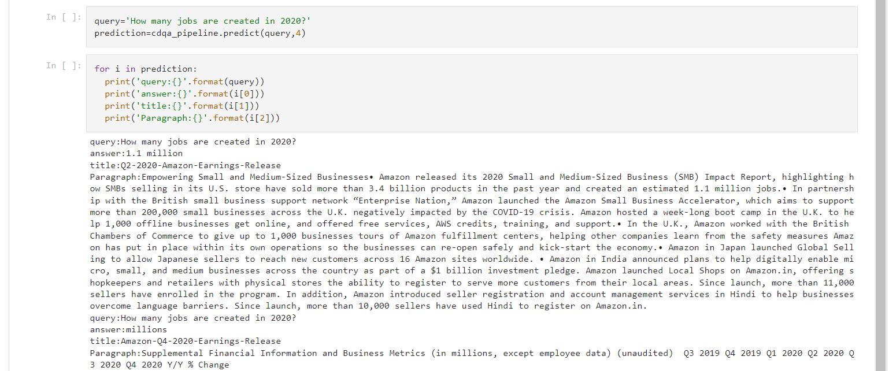

# Deep Learning QNA Project

Use Case:
  - Use an existing model which at least takes 50,000 records.
  - takes a query similar to an search engine.
  - returns answers with the probability.

Proposed Solution:
Using Bert 1.1 QNA Model into Amazon Annual Reports & FiQA Datasets which has more than 50,000 records

## Records 

## Question 1 

## Question 2

